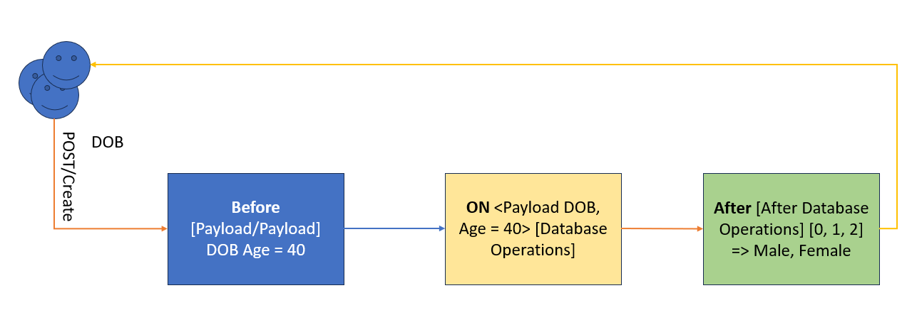

## Welcome To Employee Details Project
This is a Employee Details project Using SAP Caloud Application Programming model Using NodeJS. [Click here](https://cap.cloud.sap/docs/) to know more about CAP.

### Git Commands
- git init: To initialize teh repository
- git add .: to add all the fiels in teh commit
- git commit -m "<Message>": Create a commit with proper message
- git push: to push the code.

### CAP Events

